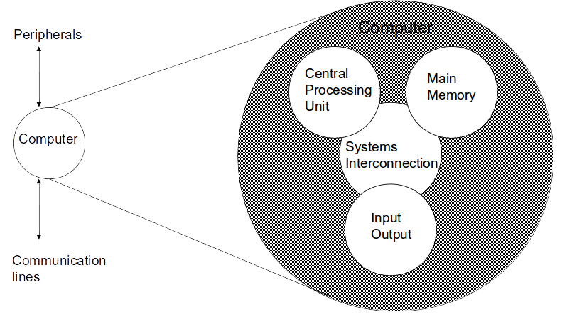
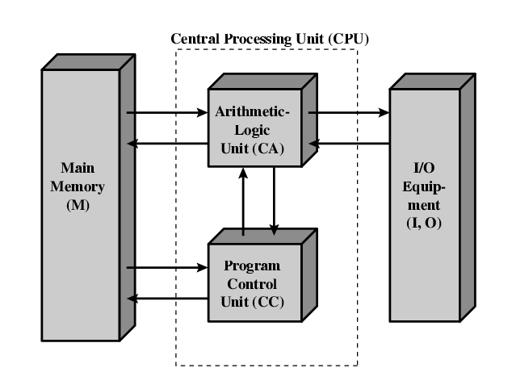

## Computer Organization and Architecture  

###### Slides from Computer Organization and Architecture, William Stallings, 8th Edition.  

#HSLIDE

### Architecture & Organization

- Architecture is the set of attributes visible to the programmer
	- Instruction set, number of bits used for data representation, I/O mechanisms, addressing techniques.
	- e.g. Is there a multiply instruction?
- Organization is how features are implemented
	- Control signals, interfaces, memory technology.
	- e.g. Is there a hardware multiply unit or is it done by repeated addition?
	
#HSLIDE

### Architecture & Organization

- All Intel x86 family share the same basic architecture
- This gives code compatibility
	- At least backwards
- Organization differs between different versions

#HSLIDE

### Function

- All computer functions are:
	- Data processing
	- Data storage
	- Data movement
	- Control

#HSLIDE

### Functional View

<!-- -->

#HSLIDE

### Operations 

- Data movement

<!-- -->

#HSLIDE

### Operations 

- Storage 

#HSLIDE

### Operation (c) Processing from/to storage 

#HSLIDE

### Operation (d) Processing from storage to I/O

#HSLIDE

### Structure - Top Level

#HSLIDE

### Structure - The CPU

#HSLIDE

## Computer Evolution and Performance

#HSLIDE

### ENIAC - background

- Electronic Numerical Integrator And Computer
- Eckert and Mauchly
- University of Pennsylvania
- Trajectory tables for weapons 
- Started 1943
- Finished 1946
	- Too late for war effort
- Used until 1955

#HSLIDE

### ENIAC - details

- Decimal (not binary)
- 20 accumulators of 10 digits
- Programmed manually by switches
- 18,000 vacuum tubes
- 30 tons
- 15,000 square feet
- 140 kW power consumption
- 5,000 additions per second

#HSLIDE

### von Neumann/Turing

- Stored Program concept
- Main memory storing programs and data
- ALU operating on binary data
- Control unit interpreting instructions from memory and executing
- Input and output equipment operated by control unit
- Princeton Institute for Advanced Studies 
	- IAS
- Completed 1952

#HSLIDE

### Structure of von Neumann machine

#HSLIDE

### Transistors

- Replaced vacuum tubes
- Smaller
- Cheaper
- Less heat dissipation
- Solid State device
- Made from Silicon (Sand)
- Invented 1947 at Bell Labs

#HSLIDE

### Microelectronics

- A computer is made up of gates, memory cells and interconnections
- These can be manufactured on a semiconductor
	- silicon wafer
	
#HSLIDE

### Growth in CPU Transistor Count

#HSLIDE

### Speeding it up

- Pipelining
- On board cache
- On board L1 & L2 cache
- Branch prediction
- Data flow analysis
- Speculative execution

#HSLIDE

### Performance Balance

- Processor speed increased
- Memory capacity increased
- Memory speed lags behind processor speed

#HSLIDE

### Logic and Memory Performance Gap

#HSLIDE

### Solutions

- Increase number of bits retrieved at one time
	- Make DRAM “wider” rather than “deeper”
- Change DRAM interface
	- Cache
- Reduce frequency of memory access
	- More complex cache and cache on chip
- Increase interconnection bandwidth
	- High speed buses
	- Hierarchy of buses
	
#HSLIDE

### I/O Devices

- Peripherals with intensive I/O demands
- Large data throughput demands
- Problem moving data 
- Solutions:
	- Buffering
	- Higher-speed interconnection buses
	- More elaborate bus structures
	- Multiple-processor configurations
	
#HSLIDE

### Typical I/O Device Data Rates

#HSLIDE

### Key is Balance

- Processor components
- Main memory
- I/O devices
- Interconnection structures

#HSLIDE

### Improvements in Chip Organization and Architecture

- Increase hardware speed of processor
	- Fundamentally due to shrinking logic gate size
		- More gates, packed more tightly, increasing clock rate
		- Propagation time for signals reduced
- Increase size and speed of caches
	- Dedicating part of processor chip 
		- Cache access times drop significantly

#HSLIDE

### Improvements in Chip Organization and Architecture

- Change processor organization and architecture
	- Increase effective speed of execution
	- Parallelism

#HSLIDE

### Problems with Clock Speed and Login Density

- Power
	- Power density increases with density of logic and clock speed
	- Dissipating heat
- Memory latency
	- Memory speeds lag processor speeds

#HSLIDE

### Problems with Clock Speed and Login Density

- RC delay
	- Speed at which electrons flow limited by resistance and capacitance of metal wires connecting them
	- Delay increases as RC product increases
	- Wire interconnects thinner, increasing resistance
	- Wires closer together, increasing capacitance
- Solution:
	- More emphasis on organizational and architectural approaches

#HSLIDE

### Intel Microprocessor Performance

#HSLIDE

### Increased Cache Capacity

- Typically two or three levels of cache between processor and main memory
- Chip density increased
	- More cache memory on chip
		- Faster cache access
- Pentium chip devoted about 10% of chip area to cache
- Pentium 4 devotes about 50%

#HSLIDE

### More Complex Execution Logic

- Enable parallel execution of instructions
- Pipeline works like assembly line
	- Different stages of execution of different instructions at same time along pipeline
- Superscalar allows multiple pipelines within single processor
	- Instructions that do not depend on one another can be executed in parallel
	
#HSLIDE

### Diminishing Returns

- Internal organization of processors complex
	- Can get a great deal of parallelism
	- Further significant increases likely to be relatively modest
- Benefits from cache are reaching limit
- Increasing clock rate runs into power dissipation problem 
	- Some fundamental physical limits are being reached
	
#HSLIDE

### Multiple Cores

- Multiple processors on single chip
	- Large shared cache
- Within a processor, increase in performance proportional to square root of increase in complexity
- If software can use multiple processors, doubling number of processors almost doubles performance
- So, use two simpler processors on the chip rather than one more complex processor
- With two processors, larger caches are justified
	- Power consumption of memory logic less than processing logic

 

