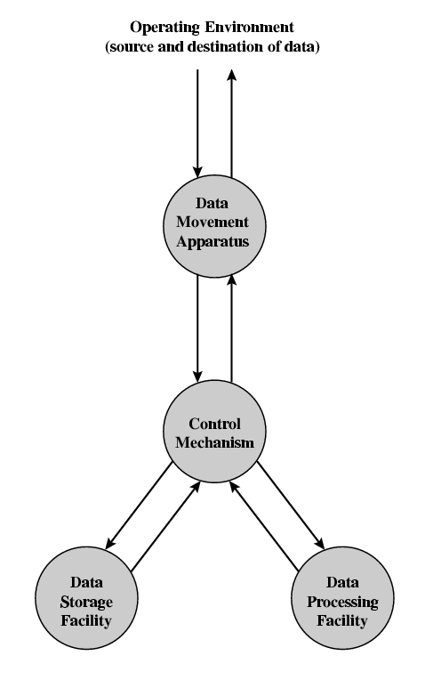

## Computer Organization and Architecture

###### Slides from Computer Organization and Architecture, 8th Edition. William Stallings 

#HSLIDE

### Architecture & Organization

- Architecture is the set of attributes visible to the programmer
	- Instruction set, number of bits used for data representation, I/O mechanisms, addressing techniques.
	- e.g. Is there a multiply instruction?
- Organization is how features are implemented
	- Control signals, interfaces, memory technology.
	- e.g. Is there a hardware multiply unit or is it done by repeated addition?
	
#HSLIDE

### Architecture & Organization

- All Intel x86 family share the same basic architecture
- This gives code compatibility
	- At least backwards
- Organization differs between different versions

#HSLIDE

### Function

- All computer functions are:
	- Data processing
	- Data storage
	- Data movement
	- Control

#HSLIDE

### Functional View

<!-- -->

#HSLIDE

